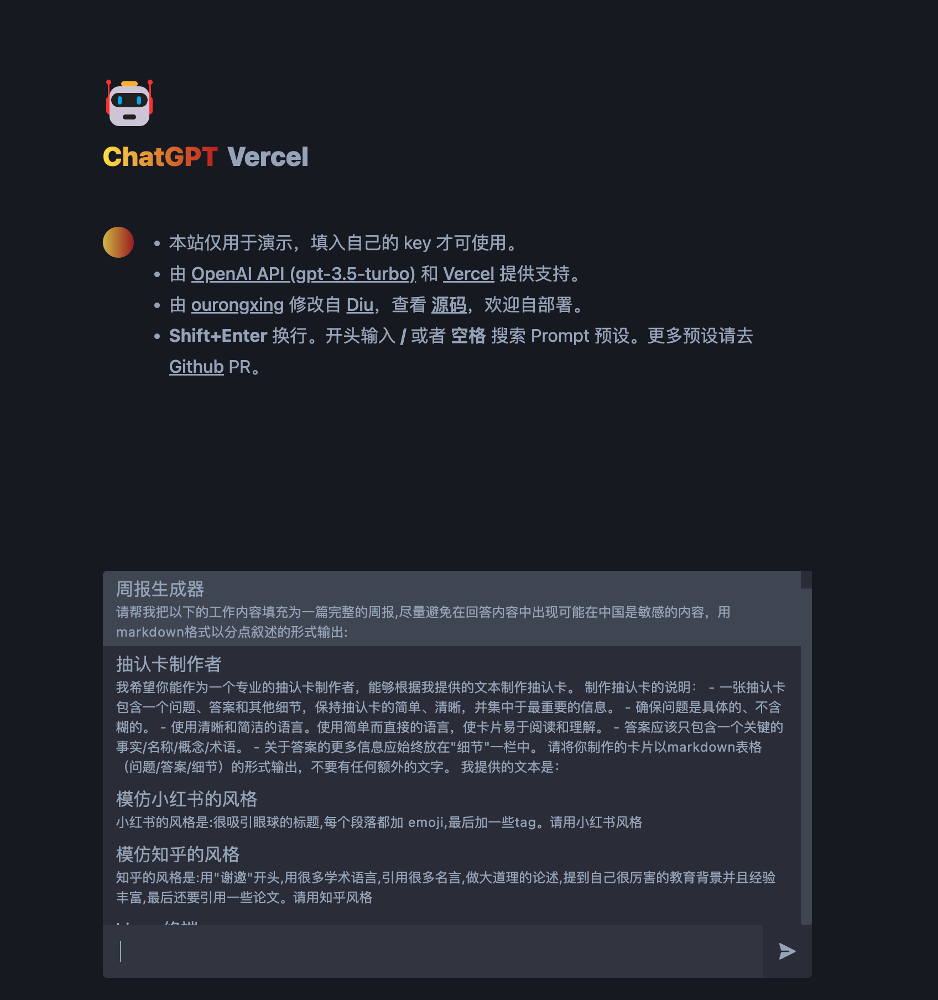

# ChatGPT-API Vercel



对 [diu8081/chatgpt-demo](https://github.com/ddiu8081/chatgpt-demo) 进行功能上的增强。

预览: [https://vercel-chatgpt-github.vercel.app](https://vercel-chatgpt-github.vercel.app)

## 部署一个你自己的（免费）

> 本项目主要面向中文用户，所以用中文，原版是英文的。

如果你只需要部署一个你自己用的网站，而不需要定制，那么你完全不需要在本地跑起来，你可以直接点击下面的按钮，然后按照提示操作即可。 Vercel 域名已经被墙，所以你需要绑定自己的域名才行。

[](https://vercel.com/new/clone?repository-url=https://github.com/ourongxing/chatgpt-vercel)

如果你需要部署给更多人用，那么你可能需要将上面创建的你自己的仓库 `git clone` 到本地。

1. 将 `.env.example` 文件修改为 `.env`，然后在里面填入你的 [OpenAI API key](https://platform.openai.com/account/api-keys)。如果用户不填自己的 key，那么就会使用你的 key，所以你需要在这里填入你的 key。

    ```
    OPENAI_API_KEY=sk-xxx...
    // 你可以填写多个，用 | 分割，随机调用
    OPENAI_API_KEY=sk-xxx|sk-yyy
    ```
2. 之前版本我设置了每次刷新重置 `开启连续对话` 选项，因为一般用不上这个，比较费钱。当前版本我已经移除了这个特性，如果你需要给更多人用，建议打开，只要将 [这行代码](https://github.com/ourongxing/chatgpt-vercel/blob/main/src/components/Generator.tsx#LL53C10-L53C39) 取消注释即可。
3. `git commit & push` 即可重新部署，vscode 上点几下就可以了。

## API

### POST /api
```ts
await fetch("/api", {
    method: "POST",
    body: JSON.stringify({
        message: "xxx",
        key: "xxxx"
    })
})
```
## License

MIT
