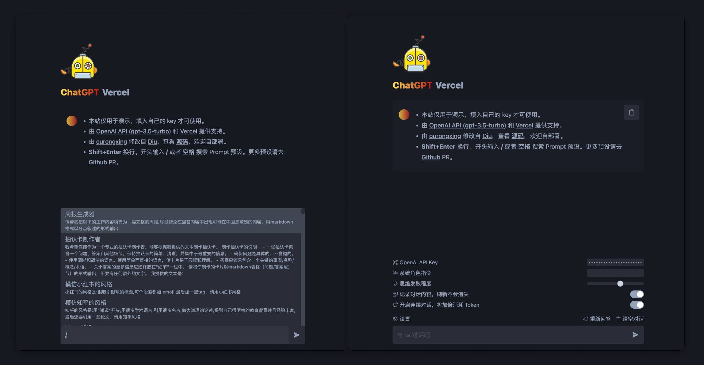

# ChatGPT-Vercel



预览: [https://vercel-chatgpt-github.vercel.app](https://vercel-chatgpt-github.vercel.app)

## 部署一个你自己的（免费）

> 本项目主要面向中文用户，所以用中文，原版是英文的。

如果你只需要部署一个你自己用的网站，而不需要定制，那么你完全不需要在本地跑起来，你可以直接点击下面的按钮，然后按照提示操作即可。 vercel 域名已经被墙，但 vercel 本身没有被墙，所以你绑定自己的域名就可以了。

[](https://vercel.com/new/clone?repository-url=https://github.com/ourongxing/chatgpt-vercel)

如果你需要部署给更多人用，那么你可能需要将上面创建的你自己的仓库 `git clone` 到本地。

1. 将 `.env.example` 文件修改为 `.env`，然后在里面填入你的 [OpenAI API key](https://platform.openai.com/account/api-keys)。如果用户不填自己的 key，那么就会使用你的 key。

    ```
    OPENAI_API_KEY=sk-xxx...
    // 你可以填写多个，用 | 分隔，随机调用。最好是多填几个，不太清楚有没有并发上的限制。
    OPENAI_API_KEY=sk-xxx|sk-yyy
    ```
    最新版本支持读取 Vercel 的环境变量，所以你也可以直接在 Vercel 上设置环境变量，如图所示。对于大部分人来说这个更方便。会在下次部署时生效。
    
2. 默认设置在 `src/default.ts` 文件中，自行修改。默认的提示信息也在这里。
    ```ts
    const defaultSetting = {
        // 连续对话，每次都需要将上下文传给 API，比较费钱，而且同样有 4096 token 的限制
        continuousDialogue: true,
        // 记录对话内容，刷新后不会清空对话
        archiveSession: false,
        openaiAPIKey: "",
        // 0-100 越高 ChatGPT 思维就越发散，开始乱答
        openaiAPITemperature: 60,
        // 系统角色指令，会在每次提问时添加。主要用于对 ChatGPT 的语气，口头禅这些进行定制。
        systemRule: ""
    }
    ```
3. 之前版本我设置了每次刷新重置 `开启连续对话` 选项，因为一般用不上这个，比较费钱。当前版本我已经移除了这个特性，如果你需要给更多人用，建议打开，只要将 [这行代码](https://github.com/ourongxing/chatgpt-vercel/blob/main/src/components/Generator.tsx#L46) 取消注释即可。

4. `git commit & push` 即可重新部署，vscode 上点几下就可以了。

如果你需要在本地开发和调试，有点麻烦
1. 升级到 `node18`，要用到原生的 `fetch`。
2. API 被墙了，自己想办法开代理，不然要报错。也可以直接 `vercel deploy` 部署到 vercel 开发环境上调试。
3. `pnpm i` 安装依赖。
4. `pnpm dev` 启动项目。
## API

### POST /api
```ts
await fetch("/api", {
    method: "POST",
    body: JSON.stringify({
        message: "xxx",
        key: "xxxx"
    })
})
```
## License

MIT
