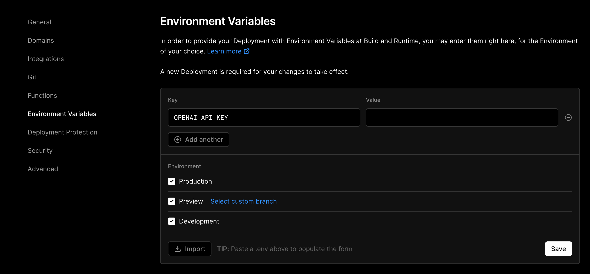

# ChatGPT-Vercel


https://user-images.githubusercontent.com/48356807/232432194-46ba797f-ad9d-476a-a739-20e0b3d63eb2.mp4


> 本项目基于 [chatgpt-demo](https://github.com/ddiu8081/chatgpt-demo) 开发。正式版本（v1.0.0）使用 Solid-Start 框架，并且不再开启 SSR。请重新设置环境变量。

在线预览:

1. [vercel.app](https://vercel-chatgpt-github.vercel.app) 被墙。
2. ~~[aitoolgpt.com](https://www.aitoolgpt.com)，由 [@AUDI_GUZZ](https://m.okjike.com/users/4af3cfb4-1291-4a8b-b210-f515c86934a9) 免费提供~~。（2023.03.22 壮烈牺牲，提醒大家不要分享自己的站点，请小范围内使用）。

## 特点

1. UI 优雅简洁的同时功能尽可能强大，细节满满，等你发现。同时满足小白和大佬使用。
2. 快速部署到国外平台，支持 Vercel，Netlify，Railway，免翻墙使用，方便分享给朋友。
3. 支持 PWA。
4. 支持 Prompts 预设，使用 <kbd>空格</kbd> 或者 <kbd>/</kbd> 搜索，可以模糊匹配，突出显示匹配的文字。
5. 支持多个对话（聊天），并且每个对话都可以单独设置，自由设置角色，不同对话可以通过 URL 直达。使用 <kbd>空格</kbd><kbd>空格</kbd> 或者 <kbd>/</kbd><kbd>/</kbd> 搜索，可以模糊匹配，搜索历史消息。
6. 支持导出和导入对话和设置。
7. 实时查看当前对话会消耗的 token 以及回答的 token，及时打断。
8. 支持多种余额查询方式，支持定时查询内置账号余额，并且发送到微信。
9. 支持 URL query，当作搜索引擎使用，所有对话都支持。比如 `url?q=keyword` 或者 `url/session/xxxxx?q=keyword`

## 使用技巧

- 有效上下文：剔除报错的部分对话。如果关闭连续对话，将只统计锁定了的部分对话。这个概念很关键。
- 锁定对话：点击每条消息前面的头像，就可以锁定了。锁定有什么好处？清空对话时，锁定了的不会删除。关闭连续对话时，始终会发送锁定了的对话，相当于角色设定。关闭 `记录对话内容` 后，始终会记录锁定了的对话，下次刷新仍然存在。

- Open AI Key 要怎么获得：注册 OpenAI 的帐号，然后 [生成 Key](https://platform.openai.com/account/api-keys) 就行了。现在注册就送 5 美元，可以用一两个月。嫌注册麻烦，可以直接去买号，自行搜索。注意不要被骗，一般 5 元以下可以入手，看到有 120 美元的 key，这种属于是绑了虚拟信用卡，可以透支 120 美元，只能用一个月，而且容易封号。现在没绑卡的账号限制比较多，并且容易封号。绑了卡也会优先扣除赠送的余额。
- 输入框
  - <kbd>Enter</kbd>发送（可关闭），<kbd>Shift</kbd>+<kbd>Enter</kbd>换行。
  - <kbd>空格</kbd> 或者 <kbd>/</kbd> 搜索 Prompt 预设，可以模糊匹配。所有 Prompt 可以查看 [prompts.md](prompts.md) 。
  - 使用 <kbd>空格</kbd><kbd>空格</kbd> 或者 <kbd>/</kbd><kbd>/</kbd> 搜索其它对话，可以模糊匹配，搜索历史消息。
  - <kbd>↑</kbd> 将最近的一次提问填到输入框里。
- 消息上的动作
  - 提问
    - 编辑：不能原地编辑，只能自动填到输入框里。
    - 重新回答：删除当前对话，然后自动发送。
    - 删除：删除当前对话。
  - 回答
    - 复制
    - 重新回答
    - 删除：只删除回答。
- 点击顶部标题滚动到顶部，点击输入框滚动到底部。
- 发送 sk- 开头的 key，可以直接查询余额。可以换行查询多个。也可以发送 `查询填写的 Key 的余额` 来直接查询你填的 key 的余额，这个 Prompt 预设第一个就是，直接用。作为站长，你可以通过设置环境变量来定时查询所有内置 key 的余额，并发送到微信上。
- url 里使用 `url?q=你好啊` 这种方式可以打开网页直接回答 `你好啊`，当作搜索引擎使用。所有的对话中都可以使用。

### 设置与动作

右边四个按钮是动作，点击就可以执行。

- 伪装角色：伪装时直接进入对话里，不会发送请求。可以伪装成用户提问以及 GPT 回答。发送后自动关闭伪装。
- 将当前对话生成图片，方便分享。在电脑上直接复制到剪贴板，手机上是下载。
- 将当前对话生成 Markdown，直接复制到剪贴板。
- 清空对话。


现在支持了多个对话，也就是多个聊天。不同的对话可以单独设置，也有不同的链接，标题，图标。所以现在有了两个设置按钮，第一个是全局设置，可以填写密码，API Key，也可以关闭 Enter 键发送，这样在手机上也可以换行。


第二个是对话设置，尽当前对话有效，针对不同的用途自行设置。目前 GPT4 仍然处于 waitlist 阶段，如果没有资格，那么无法使用。

思维发散程度越高，ChatGPT 就会乱答，如果是开放性的问题，可以适当调高，但也不要超过 1。需要确切答案的建议调为 0。

开启 `记录对话内容` 后，对话刷新也不会清空。开启连续对话后，每次会发送所有有效上下文，一开始提过有效上下文这个概念。


当你点击了设置按钮之后，会发现右边的动作按钮也发生了变化。打开全局设置后，出现的导出和导入按钮。可以导出和导入所有的设置和对话。

而打开对话设置之后，在首页，也就是主对话里，就只有一个新建对话的按钮，当你新建了对话。就会出现复制对话链接以及删除对话的按钮。值得注意的是，目前这个链接只能你自己能打开，并没有上传到云端。


在新的对话里，你可以设置标题，甚至可以设置图标，试试在标题前面加一个 Emoji。

## 部署一个你自己的 ChatGPT 网站（免费，国内直连）

[](http://vercel.com/?utm_source=busiyi&utm_campaign=oss)

> **Warning**
>
> vercel.app 域名已经被墙，但 vercel 本身没有被墙，所以你绑定自己的域名就可以了。如果广泛分享，域名有被墙的风险。如果是国内购买的域名，有请去喝茶的风险，所以要么小范围加密码使用，要么在国外购买域名。更推荐小范围内使用。

如果你只需要部署一个你自己用的网站，而不需要定制，那么你完全不需要在本地跑起来，你可以直接点击下面的按钮，然后按照提示操作，然后在 Vercel 中填入环境变量即可。


[](https://vercel.com/new/clone?utm_source=busiyi&utm_campaign=oss&repository-url=https://github.com/ourongxing/chatgpt-vercel&env=OPENAI_API_KEY)

不过上面这种方式不容易更新，最好还是先 fork 本仓库，然后在 [Vercel](https://vercel.com/new?utm_source=busiyi&utm_campaign=oss) 中导入你自己的仓库，之后要更新就在 Github 里点击 `Sync fork` 就可以同步更新了。

如果你需要部署给更多人用，需要修改一些代码，那么你可能需要将上面创建的你自己的仓库 `git clone` 到本地。改完了 `git commit & push` 即可重新部署，vscode 上点几下就可以了。也可以用 vercel 的 cli，`vercel deploy --prod`。

如果你需要在本地开发和调试，有点麻烦：

1. 升级到 `node18`，要用到原生的 `fetch` 和 `readableStream`。
2. API 被墙了，自己想办法开代理，不然要报错。可以设置 OpenAI 的代理 API，也可以直接 `vercel deploy` 部署到 vercel 开发环境上调试。
3. `pnpm i` 安装依赖。
4. `pnpm dev` 启动项目。

### 更多部署方案

目前本项目除 Vercel 以外还支持

- [Netlify](https://www.netlify.com/)：直接导入即可。
- [CloudFlare Worker](https://cloudflare.com/)：使用 Github Action 部署，需要设置 `CF_API_TOKEN`。
- [Railway](https://railway.app/)：直接导入即可。

不建议使用除 Vercel 以外的部署方案。 除了比较慢以外，更重要的是只有 Vercel 支持设置 Edge Function 服务器的地区，其他平台会自动使用距离最近的服务器，有可能是 OpenAI 不支持的地区，从而导致封号。

### 环境变量

> v1.0.0 版本环境变量变化比较大，需要重新设置。以 `CLIENT_` 开头的变量会暴露给前端，请不要填写敏感信息。

| 环境变量                  | 说明                                                                                                                                                                                                | 默认值                                                                                           |
| ------------------------- | --------------------------------------------------------------------------------------------------------------------------------------------------------------------------------------------------- | ------------------------------------------------------------------------------------------------ |
| `OPENAI_API_KEY`          | OpenAI API Key，可以填写多个，用 \| 或者 换行 隔开，随机调用。最好是多填几个，API 有并发上的限制。如果用户不填自己的 key，那么就会使用你的 key。                                                    | 无                                                                                               |
| `OPENAI_API_BASE_URL`     | 本地开发时可以填写 OpenAI 的代理服务器，但是 Vercel 不需要。并且不建议生产阶段使用。                                                                                                                | api.openai.com                                                                                   |
| `NO_GFW`                  | 表示可以服务器可以直连，不需要`OPENAI_API_BASE_URL`，就算设置了也不使用。                                                                                                                           | false                                                                                            |
| `TIMEOUT`                 | OpenAI API 超时。单位为毫秒，Vercel Edge Function 最大超时为 30000。                                                                                                                                | 30000                                                                                            |
| `PASSWORD`                | 网站密码                                                                                                                                                                                            | 无                                                                                               |
| `CLIENT_DEFAULT_MESSAGE`  | 默认提示信息                                                                                                                                                                                        | - xx xx                                                                                          |
| `CLIENT_GLOBAL_SETTINGS`  | 默认全局设置                                                                                                                                                                                        | {"APIKey":"","password":"","enterToSend":true}                                                   |
| `CLIENT_SESSION_SETTINGS` | 默认对话设置，对话设置在每个对话中都是独立的。                                                                                                                                                      | {"title":"","saveSession":true,"APITemperature":0.6,"continuousDialogue":true,"model":"gpt-3.5"} |
| `CLIENT_MAX_INPUT_TOKENS` | 有效上下文+输入的 token 数。OpenAI 不同模型的最大 token 不一样，价格也不同，可以分别设置。并且 OpenAI 会统计输入+输出之和，但我们这里只限制输入。                                                   | {"gpt-3.5":16000,"gpt-4":32000}                                                                  |
| `SEND_KEY`                | 使用 [Server 酱](https://sct.ftqq.com/sendkey) 推送帐号余额以及可用状态到微信，如果需要自行获取。推送时间为早上 8 点和晚上 8 点，在 vercel.json 文件中修改。如果 key 太多，超过 20 个，有可能失败。 | 无                                                                                               |
| `SEND_CHANNEL`            | [Server 酱](https://sct.ftqq.com/sendkey) 的推送通道，默认微信服务号。                                                                                                                              | 9                                                                                                |

有两种设置方式

1. 将 `.env.example` 文件修改为 `.env`，在 `.env` 中设置。

2. Vercel 中设置 `Environment Variables`。尽量使用这种方式，比较方便。会在下次部署时生效。

   

### 默认全局设置

> 记得删除注释，或者直接复制上面表格里的。

```json5
{
  "APIKey": "", // 默认填写的 key，不需要填写，否则其他人看得到。
  "password": "", // 默认填写的密码，不需要填写，否则其他人看得到。
  "enterToSend": true // 回车键发送消息
}
```
### 默认对话设置

> 对话设置在每个对话中都是独立的。记得删除注释，或者直接复制上面表格里的。

```json5
{
  "title": "", // 对话标题，不需要填写
  "saveSession": true, // 记录当前对话内容，刷新不会丢失。关闭后仍然会记录锁定的对话。
  "APITemperature": 0.6, // 0-2，思维发散程度，越高 ChatGPT 思维就越发散，开始乱答，甚至会乱码，建议小于 1 。
  "continuousDialogue": true, // 开启连续对话，每次都需要将上下文传给 API。
  "model": "gpt-3.5" // 模型，gpt-3.5、gpt-4。会自动根据 tokens 大小选择合适的模型。
}
```

## 提交你的 Prompts

1. Fork 本项目。
2. 修改 `prompts.md`。
3. Pull Request 即可。

如果你不懂这个操作，也可以直接在 Issues 提交你的 Prompts。目前大部分 Prompts 来自于 [awesome-chatgpt-prompts-zh](https://github.com/PlexPt/awesome-chatgpt-prompts-zh)，当然，这个仓库大多数也是翻译的 [awesome-chatgpt-prompts](https://github.com/f/awesome-chatgpt-prompts)，一并感谢。

#### 要求

- 把需要输入的内容放在最后，可以提示 ChatGPT 开始输入了，比如 “我的第一句话是：”。
- 尽可能去优化已有的 Prompts，而不是重复添加。
- 添加到结尾，我会定期整理。

## 赞赏

如果本项目对你有所帮助，可以给小猫买点零食，但不接受任何付费功能请求。


## License

[MIT](./LICENSE)
